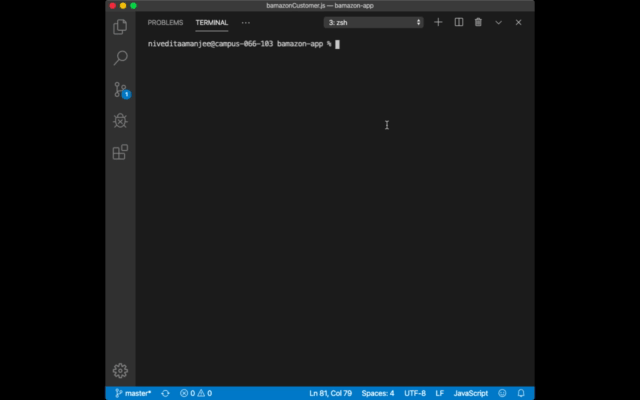
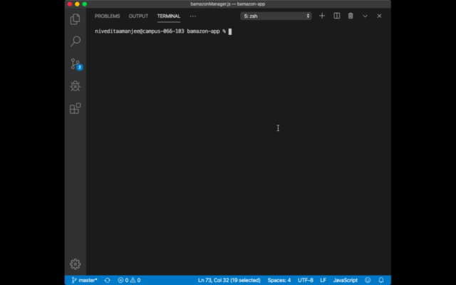
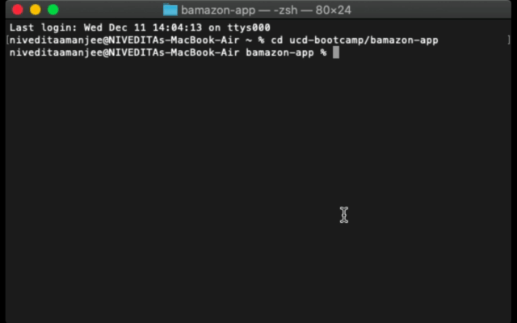

# bamazon-app
This application demonstrates the interaction between Node.js and MySQL to create a command line appication that resembles an Amazon store-front where customers can set orders and stock quantity will deplete from the inventory database. Additionally, this application can be accessed through a manager's view where managers can choose to view the categories of the database and manipulate as needed. 

## Technologies Used
* Node.js
* Javascript 
* MySQL 
* Inquirer npm 

## Customer View Demo 

A customer can choose to view the products, and also which product and how much of that product they would like to purchase. Then the purchase price is calculated and displayed to the customer while the database of stock quantity depletes. 

## Manager View Demo

A manager can choose to View Products for Sale, View Low Inventory, Add to Inventory, or Add a New Product.  

### View Products for Sale and View Low Inventory 

A manager's view differs from the customer's view; managers can view the department and stock quantity of the products in addition to name, ID, and price. Managers can also view low inventory, or any product with a stock quantity lower than 10 units. 

### Add to Inventory and Add a New Product 

Managers can choose to add to their inventory. When they choose this option, they can choose an existing product and enter the number of units they would like to add to the stock quantity; then the database in MySQL will update accordingly. Additionally, managers can choose to add a new product. When they do so, they can enter the name, department, price, and stock quantity of the new product, and the product will get added to the mySQL table. 

